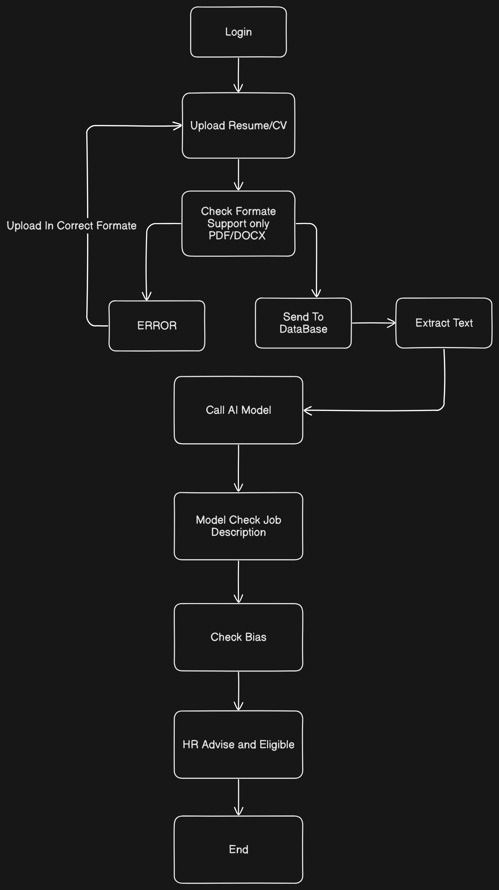

# 🧠 Fair Hiring Using AI for Business

A smart, ethical hiring assistant powered by AI. This project streamlines the recruitment process by analyzing resumes and matching candidates to job descriptions — all while ensuring fairness, transparency, and bias-free evaluation.

## 🔍 Features:

Upload and parse PDF resumes

Compare resumes with job descriptions using AI (Mistral )

Intelligent eligibility evaluation using Ollama

Personalized guidance for candidates

Modern frontend with built-in career guidance chatbot

Django backend with secure PDF handling

No reliance on LinkedIn or external profiles

## 🔧 Tech Stack:

Python, Django

Ollama

HTML/CSS/JS frontend

Chatbot integration

MySQL (user and resume data)

## 🚀 Use Case: 
Ideal for HR departments, startups, and businesses seeking a fair, AI-powered hiring tool that prioritizes candidate skills, projects, and experience over biases.

## ✍️WorkFlow

{width=600px}

## 🐍Run AI Locally

Install Ollama from 

```bash
  https://ollama.com/
```
Install LLM in Terminal 

```bash
  ollama run mistral
```

Clone the project

```bash
  git clone https://github.com/adityaanand05/Fair-Hiring-Using-AI-for-Business.git
```

Go to the project directory

```bash
  cd Fair-Hiring-Using-AI-for-Business
```

Install dependencies

```bash
  pip install ollama pdfplumber python-docx 
```

Test Your CV or Resume

```bash
  python3 -u "Your .py File Path"
```


## 🚀 About Us
We are Engineering Students at Netaji Subhash Engineering College.


## 🔗 Connect With Us

### Aditya Anand
[](https://adityaanand05.github.io/Profile/)

[GitHub Profile](https://github.com/adityaanand05)

[](https://www.linkedin.com/in/adityaanand05?lipi=urn%3Ali%3Apage%3Ad_flagship3_profile_view_base_contact_details%3BqfFyqcfZTROM0RPuhKxRYg%3D%3D)

### Shubham Barnwal
[GitHub Profile](https://github.com/Mrbarnwal)

[](https://www.linkedin.com/in/shubham-barnwal-b598a732a?lipi=urn%3Ali%3Apage%3Ad_flagship3_profile_view_base_contact_details%3Boq18qAH3QWOMRsfkIn7Qig%3D%3D)

### Ayushi Bharti
[GitHub Profile](https://github.com/Ayushi-Bharti)

[]()

### Harsh Bhardwaj
[GitHub Profile](https://github.com/harshfuran)

[]()

### Meghna De
[GitHub Profile](https://github.com/Meghna-De)

[](https://www.linkedin.com/in/meghna-de-445241324?lipi=urn%3Ali%3Apage%3Ad_flagship3_profile_view_base_contact_details%3BvkBN%2FDH5TvyHVKvOjJKkgA%3D%3D)

